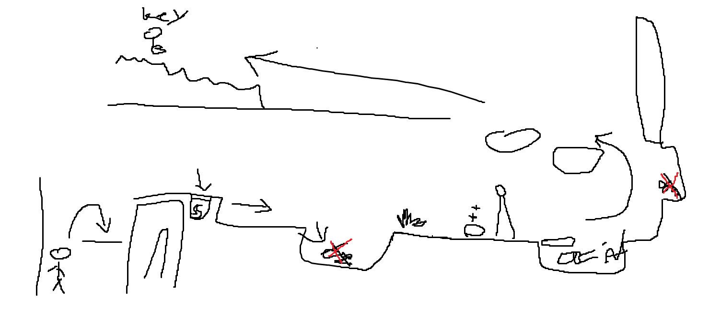

# COMP2150  - Level Design Document
### Name: Shuo-Wen (Auston) Chang
### Student number: 46291539

## 1. Player Experience (~700 words)

In the game's level design, each section serves a distinct purpose, contributing to the overall player experience and skill development:

Section 1, serving as Level 1, serves as the introductory phase. Here, players acquaint themselves with fundamental mechanics and dynamics, ensuring a gentle learning curve. Despite its brevity, this level provides essential groundwork, laying the foundation for subsequent challenges.

Section 2, corresponding to Level 2, presents heightened difficulty by introducing additional enemies and requiring more advanced skills. Players encounter obstacles such as a triggered door and vertical climbing segments, fostering improved control and comprehension of gameplay nuances. This level acts as a stepping stone, preparing players for the escalating challenges of Section 3.

Section 3, the final level, presents the ultimate test of player proficiency. With an abundance of adversaries and confined spaces, players must demonstrate mastery of controls to navigate successfully. Close-quarters combat necessitates precise maneuvering and strategic evasion to overcome the heightened difficulty. Additionally, the map's reversible nature ensures players must utilize acquired keys efficiently, further enhancing the challenge and depth of the gameplay experience.

Upon completing all levels, players must locate and utilize acquired keys to access the key door. This mechanic encourages thorough exploration and ensures players have fully engaged with each level's challenges. Moreover, the option to retrace one's steps underscores the game's non-linear design, offering players flexibility in their approach and fostering replayability.

Through these meticulously crafted level sections, players undergo a comprehensive journey of skill development and progression, culminating in a satisfying and immersive gaming experience.

### 1.1. Discovery

Players can learn from the game that they should maintain a steady pace and observe the surrounding environment because all designs have their meaning, so if you accidentally miss any trivial details, you may need to spend more time looking for them or make sure the correction. 

The structure of encounter creation is clear and concise, making it easier for users to understand the game. 

Feedback from your own playtests helps reinforce learning and correct misunderstandings. 

### 1.2. Drama

Start with easier challenges or tasks at the beginning of the game to ease players into the experience. As they become more familiar with the mechanics and gameplay, gradually increase the difficulty to keep their interest and remain challenged. 

Introduce a variety of game mechanics, challenges, and obstacles to keep the experience fresh and engaging. Alternating between diverse types of gameplays helps prevent monotony and adds depth to the overall experience. 

Pay attention to the pacing of your game, ensuring that intense moments are balanced with quieter, more contemplative sections. Monsters in the game do not respawn, so if you kill them, you will have a lot of room to relax. But before that, the monster will not stop attacking at will. 

### 1.3. Challenge

The challenge is making sure the game mechanics are intuitive and easy for inexperienced players to understand. Overwhelming players with complex mechanics or information from the start can lead to frustration and disengagement. To solve this problem, you can introduce mechanics gradually through tutorials, tooltips, or guided gameplay sequences, allowing players to learn at their own pace. 

### 1.4. Exploration

Each section has been carefully designed with a unique aesthetic and layout to create an unforgettable and immersive space. Whether it is a lush forest, a vast cityscape, or a mysterious underground cavern, the visual and spatial design of each level has been carefully crafted to evoke an atmosphere and atmosphere that captivates players and invites them to explore. My level design focuses on creating environments that foster autonomy, encourage exploration, and provide players with a memorable and immersive experience that keeps them engaged from start to finish. 

## 2. Core Gameplay (~400 words)

In the initial stage, players are introduced to Passthrough Platforms and Weapon Pickup (Staff). This dual encounter serves as a tutorial, educating players on their ability to navigate special terrain and acquire weaponry essential for progression. Notably, failure to utilize Passthrough Platforms to obtain the weapon leads to player entrapment, emphasizing the importance of mastering this mechanic.

Upon obtaining the weapon, players face obstacles that impede progress, prompting them to employ newfound abilities to dismantle barriers. Subsequently, encounters with Chompers introduce players to close-range combat dynamics, encouraging strategic engagement to overcome adversaries.

As players advance, they encounter indestructible obstacles like Spikes, which pose imminent danger by depleting player health upon contact. Negotiating these hazards necessitates careful evasion, although Health Pickups are strategically placed to mitigate potential setbacks.

Further along the journey, players navigate treacherous Acid-laden terrain, necessitating deft maneuvering atop Moving Platforms to traverse safely. Here, the introduction of Spitters underscores the importance of ranged attacks to neutralize threats from a distance, enhancing gameplay depth and variety.

Progressing onward, players unlock the first key, marking a pivotal milestone in their journey. Level 2 introduces Weapon Pickup (Gun), augmenting players' arsenal with remote attack capabilities. This newfound firepower enables players to trigger switches, unlocking pathways and facilitating progress through Trigger Doors toward the level's conclusion.

Throughout these encounters, the introduction of progressively complex mechanics and adversaries ensures players are continuously challenged while gradually mastering essential gameplay elements. This deliberate pacing and layered progression foster engagement and mastery, enhancing the overall player experience.

### 2.1. Passthrough Platforms 

### 2.2. Weapon Pickup (Staff)

### 2.3. Chompers

### 2.4. Spikes

### 2.5. Health Pickups 

### 2.6. Checkpoints

### 2.7. Acid 

### 2.8. Moving Platforms

### 2.9. Spitters

### 2.10. Keys

### 2.11. Weapon Pickup (Gun)

## 3. Spatiotemporal Design
A section on Spatiotemporal Design, which includes your molecule diagram and annotated level maps (one for each main section of your level). These diagrams may be made digitally or by hand, but must not be created from screenshots of your game. The annotated level maps should show the structure you intend to build, included game elements, and the path the player is expected to take through the level. Examples of these diagrams are included in the level design lectures.

No additional words are necessary for this section (any words should only be within your images/diagrams).

### 3.1. Molecule Diagram

### 3.2. Level Map – Section 1

### 3.3. Level Map – Section 2

### 3.4. Level Map – Section 3

## 4. Iterative Design (~400 words)
In initial iterations, the game design was too simplistic, and the map sizes were small, failing to provide a challenging enough experience. Recognizing this, the second prototype aimed to address these shortcomings by increasing the map size and slightly raising the difficulty level. However, despite these tweaks, the overall feel of the game still does not live up to the expectations of the final product. 

To bridge this gap, several enhancements were introduced in the third prototype. This iteration focused on enhancing class distinction by adding various design elements. It's worth noting that the third level received a lot of attention, ironing out minor design flaws and injecting more captivating features into the gameplay. These enhancements inject new richness and appeal into the entire game, improving the player experience. 

However, despite these improvements, feedback shows that the second tier of the third prototype is still lackluster. As a result, the last version underwent further refinement, with a special emphasis on enhancing the design and clarity of the second layer. Additionally, we have made careful improvements to every aspect of the map to ensure players have many opportunities to experience the gradual evolution and unfolding of challenges throughout the game. This iterative process resulted in a final product that provides players with a deeply satisfying journey characterized by subtle changes and an engaging gameplay experience. 

## Generative AI Use Acknowledgement

Use the below table to indicate any Generative AI or writing assistance tools used in creating your document. Please be honest and thorough in your reporting, as this will allow us to give you the marks you have earnt. Place any drafts or other evidence inside this repository. This form and related evidence do not count to your word count.
An example has been included. Please replace this with any actual tools, and add more as necessary.

### Tool Used: ChatGPT
**Nature of Use** Improving the wordings with my original texts.

**Evidence Attached?** 

**Additional Notes:** I use ChatGPT to try to add more words because of the word lake, and improve the grammar because the English skills are insufficient and I can't use my English skills like a normal English person.

### Tool Used: Google Translate
**Nature of Use** Translate the words I don't really know the meaning or typing Chinese and translate them to English so I can use them into the document.

**Evidence Attached?**

**Additional Notes:**

