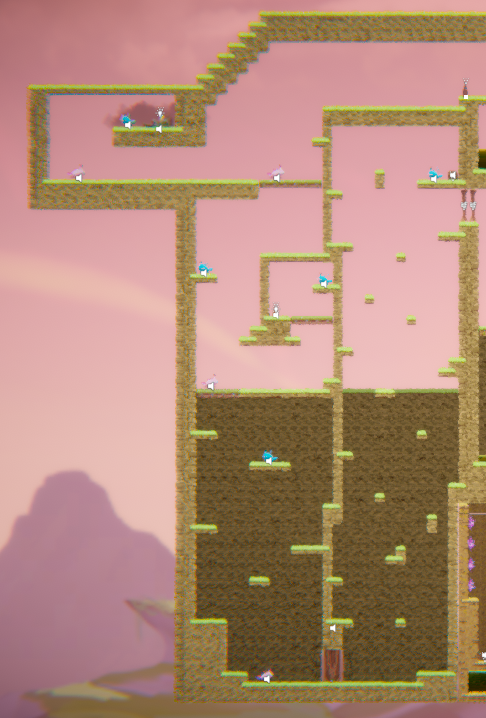

# COMP2150  - Level Design Document
### Name: Shuo-Wen (Auston) Chang
### Student number: 46291539

## 1. Player Experience (~700 words)
Outline and justify how your level design facilitates the core player experience goals outlined in the assignment spec. Each section should be supported by specific examples and screenshots of your game encounters that highlight design choices made to facilitate that particular experience.

Each level section has its own meaning. Level one, which is section one, is the introduction. It gives players the chance to understand the mechanics and the dynamics. It causes the section to be easy but a short level. Level 2 (Section 2) is a level that increases some enemies and requires a bit of skills. It means that you cannot easily pass through it like Section 1. It has a door players need to trigger, and players need to climb up to reach the next key and next level so it helps you to improve players controlling and understanding of the game so players can get prepared for the next level which is Section 3. The final level has many monsters and stuff that needs to be triggered. The map is not very spacious, so enemies get close, making the level more difficult. Players may need some better controlling for them to dodge the attacks. After all the levels, players should already find all the keys and find the way back to the key door otherwise players can still go back the same way because the map is reversible. 

### 1.1. Discovery
What does the player learn? How does your encounter and broader level design facilitate learning in a way that follows good design practice?

Players can learn from the game that they should maintain a steady pace and observe the surrounding environment because all designs have their meaning, so if you accidentally miss any trivial details, you may need to spend more time looking for them or make sure the correction. 

The structure of encounter creation is clear and concise, making it easier for users to understand the game. 

Feedback from your own playtests helps reinforce learning and correct misunderstandings. 

### 1.2. Drama
What is the intensity curve? How does your design facilitate increasing yet modulating intensity, with moments of tension and relief? 

Start with easier challenges or tasks at the beginning of the game to ease players into the experience. As they become more familiar with the mechanics and gameplay, gradually increase the difficulty to keep their interest and remain challenged. 

Introduce a variety of game mechanics, challenges, and obstacles to keep the experience fresh and engaging. Alternating between diverse types of gameplays helps prevent monotony and adds depth to the overall experience. 

Pay attention to the pacing of your game, ensuring that intense moments are balanced with quieter, more contemplative sections. Monsters in the game do not respawn, so if you kill them, you will have a lot of room to relax. But before that, the monster will not stop attacking at will. 

### 1.3. Challenge
What are the main challenges? How have you designed and balanced these challenges to control the difficulty curve and keep the player in the flow channel?

The challenge is making sure the game mechanics are intuitive and easy for inexperienced players to understand. Overwhelming players with complex mechanics or information from the start can lead to frustration and disengagement. To solve this problem, you can introduce mechanics gradually through tutorials, tooltips, or guided gameplay sequences, allowing players to learn at their own pace. 

### 1.4. Exploration
How does your level design facilitate autonomy and invite the player to explore? How do your aesthetic and layout choices create distinct and memorable spaces and/or places?

Each section has been carefully designed with a unique aesthetic and layout to create an unforgettable and immersive space. Whether it is a lush forest, a vast cityscape, or a mysterious underground cavern, the visual and spatial design of each level has been carefully crafted to evoke an atmosphere and atmosphere that captivates players and invites them to explore. My level design focuses on creating environments that foster autonomy, encourage exploration, and provide players with a memorable and immersive experience that keeps them engaged from start to finish. 

## 2. Core Gameplay (~400 words)
A section on Core Gameplay, where storyboards are used to outline how you introduce the player to each of the required gameplay elements in the first section of the game. Storyboards should follow the format provided in lectures.

Storyboards can be combined when multiple mechanics are introduced within a single encounter. Each section should include a sentence or two to briefly justify why you chose to introduce the mechanic/s to the player in that sequence.

You should restructure the headings below to match the order they appear in your level.

### 2.1. Passthrough Platforms 

### 2.2. Weapon Pickup (Staff)

### 2.3. Chompers

### 2.4. Spikes

### 2.5. Health Pickups 

### 2.6. Checkpoints

### 2.7. Acid 

### 2.8. Moving Platforms

### 2.9. Spitters

### 2.10. Keys

### 2.11. Weapon Pickup (Gun)

## 3. Spatiotemporal Design
A section on Spatiotemporal Design, which includes your molecule diagram and annotated level maps (one for each main section of your level). These diagrams may be made digitally or by hand, but must not be created from screenshots of your game. The annotated level maps should show the structure you intend to build, included game elements, and the path the player is expected to take through the level. Examples of these diagrams are included in the level design lectures.

No additional words are necessary for this section (any words should only be within your images/diagrams).
 
### 3.1. Molecule Diagram

### 3.2. Level Map – Section 1

### 3.3. Level Map – Section 2

### 3.4. Level Map – Section 3

## 4. Iterative Design (~400 words)
Reflect on how iterative design helped to improve your level. Additional prototypes and design artefacts should be included to demonstrate that you followed an iterative design process (e.g. pictures of paper prototypes, early grey-boxed maps, additional storyboards of later gameplay sequences, etc.). You can also use this section to justify design changes made in Unity after you drew your level design maps shown in section 3. 

You should conclude by highlighting a specific example of an encounter, or another aspect of your level design, that could be improved through further iterative design.

## Generative AI Use Acknowledgement

Use the below table to indicate any Generative AI or writing assistance tools used in creating your document. Please be honest and thorough in your reporting, as this will allow us to give you the marks you have earnt. Place any drafts or other evidence inside this repository. This form and related evidence do not count to your word count.
An example has been included. Please replace this with any actual tools, and add more as necessary.

### Tool Used: ChatGPT
**Nature of Use** Finding relevant design theory.

**Evidence Attached?** Screenshot of ChatGPT conversation included in the folder "GenAI" in this repo.

**Additional Notes:** I used ChatGPT to try and find some more relevant design theory that I could apply to my game. After googling them, however, I found most of them were inaccurate, and some didn't exist. One theory mentioned, however, was useful, and I've incorporated it into my work.

### Tool Used: Example
**Nature of Use** Example Text

**Evidence Attached?** Example Text

**Additional Notes:** Example Text

